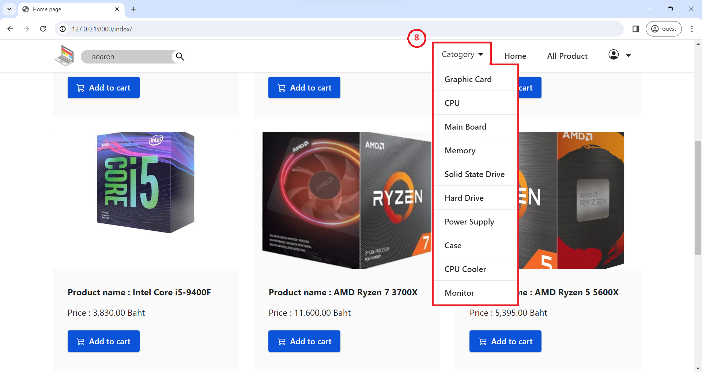

# E-commerce-Project

This project was created to study the creation of web applications using the Django framework and to improve the author's coding skills. It is not intended for commercial purposes.

In general, this project simulates a web-based store. It consists of four major systems:
1. **Storefront system**
2. **User registration system** 
3. **Shopping cart system** 
4. **Order history system**
   
For more detailed information, please refer to the following sections.

The code includes comments that explain how it works. You can view the code and comments, but the comments are in Thai. We apologize for any inconvenience this may cause.

**Requirements**
* Python 
* Django 
* Pillow 

## Details

When the user opens the website, they will be on the store's landing page. This page contains a nav-bar (1), which displays a list of the menus available on the website. The website also has a footer (2), which is located at the bottom of the page. When the user clicks the "go to shop" button, they will be taken to the homepage.

When the user arrives at the homepage, they will see a list of the most popular products. Each product will have a picture, name, price, and a button to add it to the cart. The user can tell that they are on the popular products page by looking at the URL (4). If the user is on any other page, they can click the "Home" button (5) to return to the popular products page.

If the user clicks the "All Products" button (6), they will be taken to a page that lists all of the products available in the store.

At the bottom of the page, the user will see a pagination tab (7). Clicking on a page number will take the user to that page of products.

If the user clicks the "Category" button (8), they will be taken to a page that lists all of the products in each category. This makes it easier for users to find the products they are looking for.

For example, if the user searches for hard drives by category, they can check the URL (9).

When the user clicks the profile icon (10), a dropdown will appear with two options: login and register. If the user clicks the login option, a login window will appear, as shown in the image below. The user can check the URL (11) to verify that they are on the login page. 

